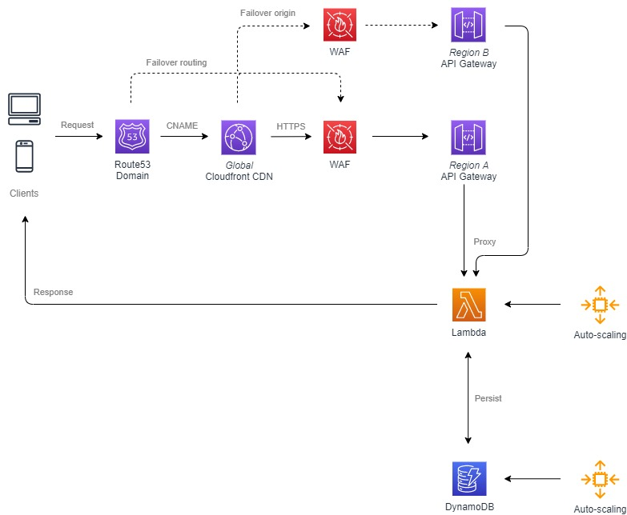

# wizardly-zhukovsky

Johnny Huynh - Lead DevOps Engineer @ crypto.com

## Access Log Analytics

You are given an access log file (access.log.gz) containing some requests.
Please prepare 3 shell script files as follows: (Note: any shell script executable on the
modern Linux environment, pure shell like sh, bash, csh, zsh are preferred)

1. Count the total number of HTTP requests recorded by this access logfile
2. Find the top 10 hosts that made the most requests from `2019-06-10 00:00:00` up to
and including `2019-06-19 23:59:59`
3. Find the country that made the most requests *(hint: use the source IP address as a
start)*

### Usage

Run the following commands to get answers to the first assessment.

`bash` will be the required script runtime.

We're git ignoring the `access.log` file granted that's fairly large at 18 MB. However, we'll be using `gunzip` to uncompress the provided `.gz` file.

```bash
# Get the total count of requests
./total-number.sh

# Find the top 10 hosts
./top-10-hosts.sh

# Find the country that made the most requests
./country-most-requests.sh
```

## System Design

We are designing a simple bit.ly-like service (API only), which includes two web API endpoints,
as follows:

### Web API endpoint for url submission

`POST` `/newurl`

#### Request

```json
{ "url": "https://www.google.com" }
```

#### Response

```json
{ "url": "https://www.google.com", "shortenUrl": "https://shortenurl.org/g20hi3k9"}
```

### Web API endpoint for redirecting a shortened URL to the real URL

Note: The shortened link cannot be modified once created)

`GET` `/[a-zA-Z0-9]{9}` (RegEx, eg. g20hi3k9t)

HTTP 302 redirection to the real URL

### System Design Concerns

#### High Availability

Route53 failover routing in the case Cloudfront distributions fail globally (edge case). Cloudfront CDNs can then failover regional API gateways in the case the region fails. This might increase latency, however we can mitigate with a replicated API gateway in neighboring regions.

#### Scalability

Lambda functions can run at scale as we pay per invocation. No dedicated auto-scaling compute resources are required in serverless functions.

We can also provide DynamoDB auto-scaling of write and read instances in the case load drastically increases.

#### Tech Stack

DynamoDB used as a NoSQL stateful backend to reduce complex schema building. Shortened link data can be stored in a NoSQL backend with the link ID being the primary index. Lookup of the ID can be the provided through the actual shortened link.

Lambda functions can serve the internal logic to shorten URLs. This should only be the responsibility of the Python script along with persistance. Python can be run multi-platform and developers can use serverless frameworks to debugging.

### Architecture Diagram



### Database schema

Database can be fetched from one table with a timestamp. As mentioned the ID can be generated through the Python script and used as the path to fetch the real link.

| Column       | Type   |
|--------------|--------|
| id (primary) | string |
| link         | string |
| created_at   | string |

### Pseudo code

This will detail what the business logic we need to provide shortened URLs.

```bash
# When user sends a POST request to /newurl
declare createShortLink with json do

    get realUrl from json
    get hostUrl from environment

    generate shortLinkId
    save shortLinkId realUrl to DynamoDB
    
    create url with realUrl
    create shortUrl with hostUrl and shortLinkId
    create jsonResult with url and shortUrl

    return jsonResult

done

# When user sends a GET request to /[a-zA-Z0-9]{9}
declare getShortLink with path do

    match path with regex /[a-zA-Z0-9]{9}
    create shortLinkId with path
    get hostUrl from environment

    get shortLinkId from DynamoDB

    if shortLinkId doesnt exist in DynamoDB then
        throw error not found
    done
    
    create shortUrl with hostUrl and shortLinkId

    return redirect to shortUrl
done
```

### Design considerations

We can use CI/CD pipelines like Buildkite or GitHub Actions granted that we write all of our infrastructure in source control repositories like Git with GitHub. We can then build automation through code change triggers to reduce the feedback loop of changes.

We'll use Terraform as the tooling of choice for infrastructure as code since we backed by the open source community in terms of provider and core tooling development. SMEs within our team are welcome to contribute outbound to help others in the industry. This also benefits from avoiding knowledge siloing in the case engineers leave the company.

### Assumptions & limitations

- There's at least a staging or development environment prior to production
- Greenfields project no cloud migration required including such things like database migrations
- ACID transactions in a DynamoDB is not possible due to the inherit NoSQL design

### References

https://stackoverflow.com/questions/12457457/count-number-of-lines-in-terminal-output
https://unix.stackexchange.com/questions/156261/unzipping-a-gz-file-without-removing-the-gzipped-file
https://unix.stackexchange.com/questions/360273/a-command-to-do-bulk-ip-address-lookups-using-unix-command-line-works-on-a-unix/360284
https://stackoverflow.com/questions/2034799/how-to-truncate-long-matching-lines-returned-by-grep-or-ack
https://unix.stackexchange.com/questions/83473/get-my-country-by-ip-in-bash
https://docs.aws.amazon.com/AmazonCloudFront/latest/DeveloperGuide/high_availability_origin_failover.html
https://medium.com/swlh/how-to-expose-aws-http-api-gateway-via-aws-cloudfront-16383f45704b
https://docs.aws.amazon.com/Route53/latest/DeveloperGuide/dns-failover-configuring.html
https://blog.cloudcraft.co/programming-your-cdn/
